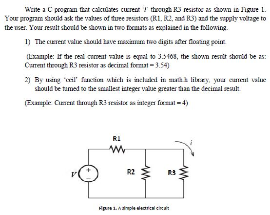
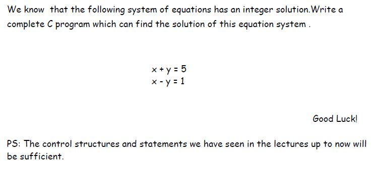
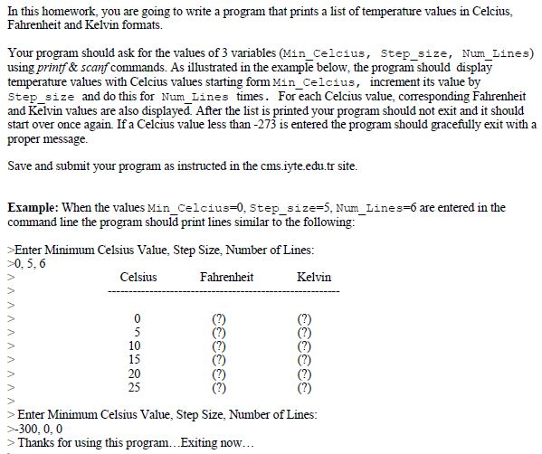
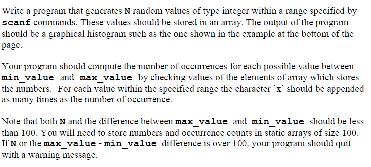
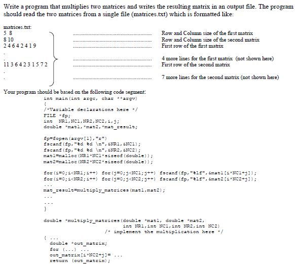

# C_Programming_Exercises

## Introduction

This repo contains my lab studies in courses EE103 Introduction to Programming. This course explains basics of programming using C programming language. Lab studies covers topics listed below.

* Introduction to C Language
* Conditional Statements
* Loops
* Operators
* Functions
* Strings
* Pointers
* Structures
* File Handling

### Homework-1 problem

### Homework-2 problem

### Homework-3 problem

### Homework-4 problem

### Homework-5 problem

